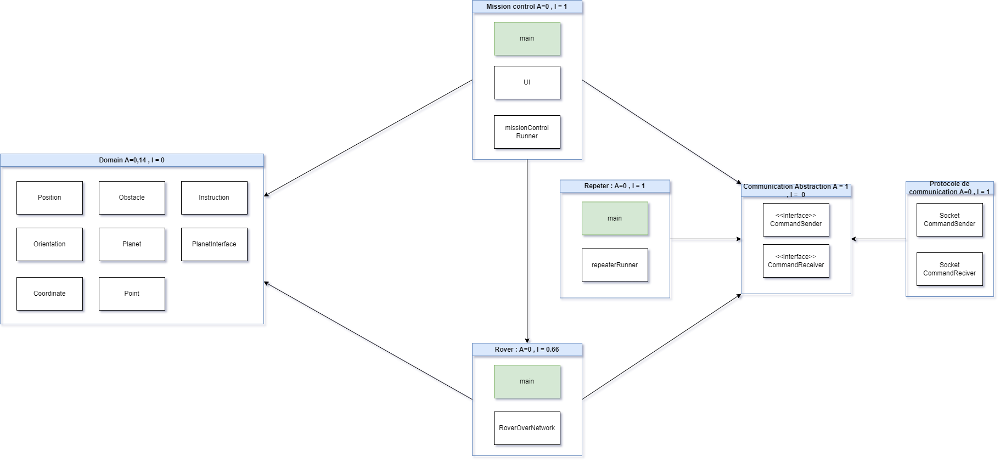

# Documentation d'utilisation de l'application Mars Rover

## Schéma de l'Architecture

## Lancement de l'application

### 1ère possibilité : Lancement sans Repeater

1. Ouvrez un terminal.
2. Accédez au répertoire de l'application Rover en utilisant la commande `cd Rover`.
3. Lancez l'application Rover avec la commande `python main.py`.
4. Ouvrez un deuxième terminal.
5. Accédez au répertoire de l'application Mission Control en utilisant la commande `cd MissionControl`.
6. Lancez l'application Mission Control avec la commande `python main.py`.

### 2ème possibilité : Utilisation du Repeater

1. Si vous utilisez le Repeater, ouvrez un terminal.
2. Accédez au répertoire de l'application Rover en utilisant la commande `cd Rover`.
3. Lancez l'application Rover avec la commande `python main.py`.
4. Ouvrez un deuxième terminal.
5. Accédez au répertoire de l'application Repeater en utilisant la commande `cd Repeater`.
6. Lancez l'application Repeater avec la commande `python main.py`.
7. Ouvrez un dernier terminal.
8. Accédez au répertoire de l'application Mission Control en utilisant la commande `cd MissionControl`.
9. Lancez l'application Mission Control avec la commande `python main.py`.

## Configuration de l'application

Si vous souhaitez modifier la configuration de l'application, suivez ces étapes :

1. Accédez au fichier `Mission/marsMission.py`.
2. Modifiez les paramètres de configuration selon vos préférences.
   - Par exemple, configurez si le Repeater doit être utilisé.
   - Ajustez la taille de la planète.
   - Définissez la position de départ du rover, etc.

Sauvegardez les modifications avant de lancer à nouveau l'application.

## Exécution des tests

Pour exécuter les tests de l'application, suivez ces étapes :

1. Ouvrez un terminal.
2. Accédez au répertoire des tests en utilisant la commande `cd Tests`.
3. Lancez les tests de commande avec la commande `python CommandTests.py`.
4. Pour exécuter les tests du Rover, utilisez la commande `python RoverTests.py`.

Assurez-vous d'avoir l'environnement de test correctement configuré avant d'exécuter les tests.
